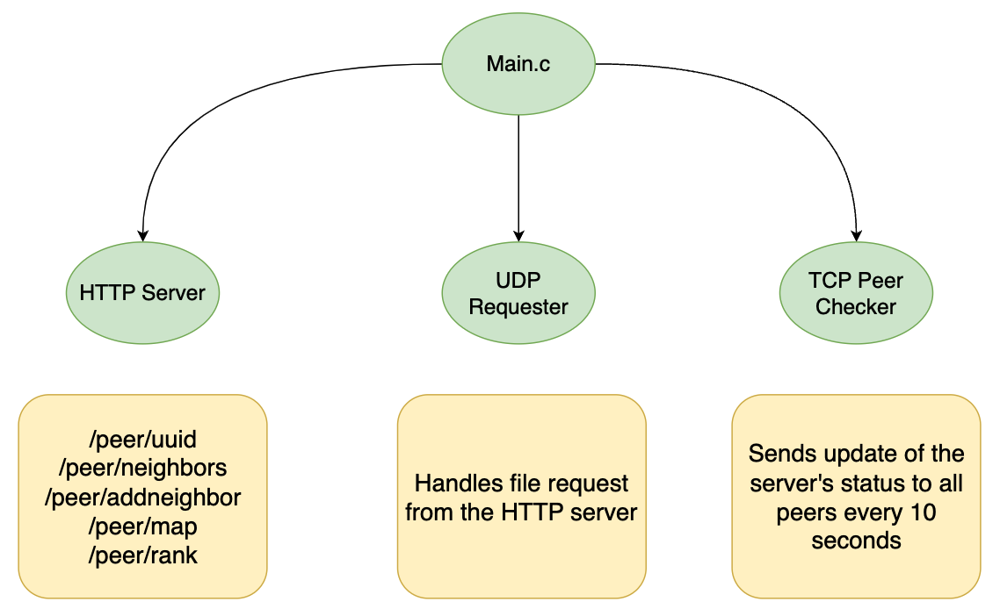
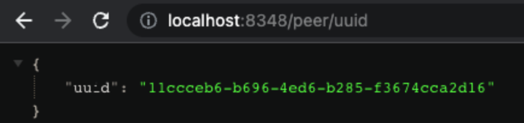
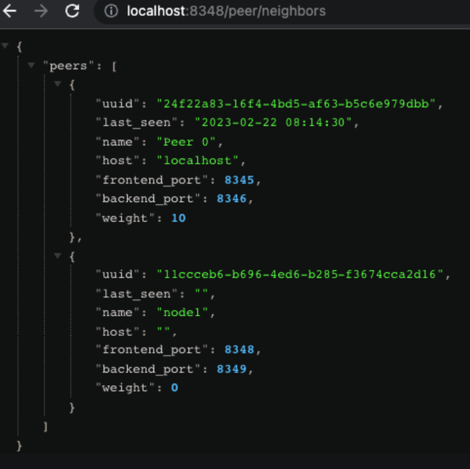
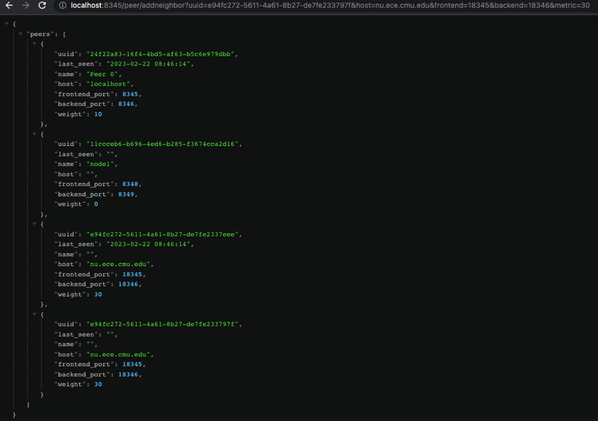
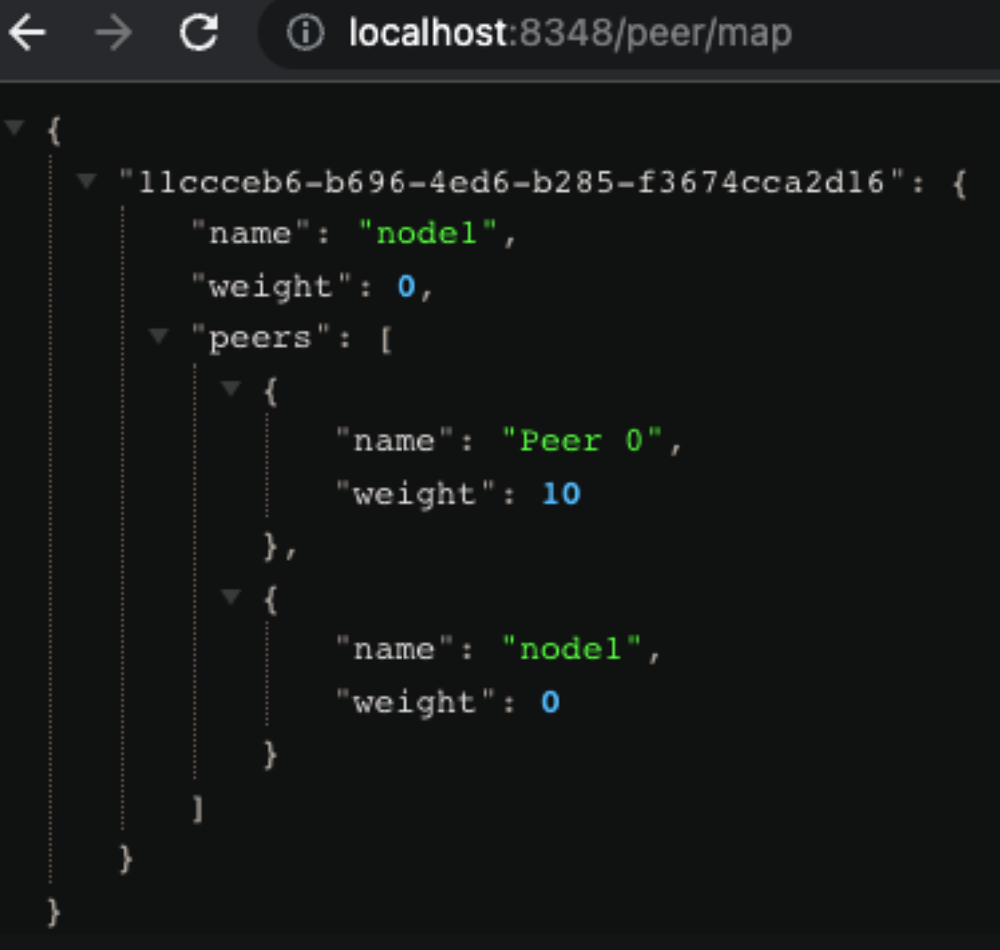
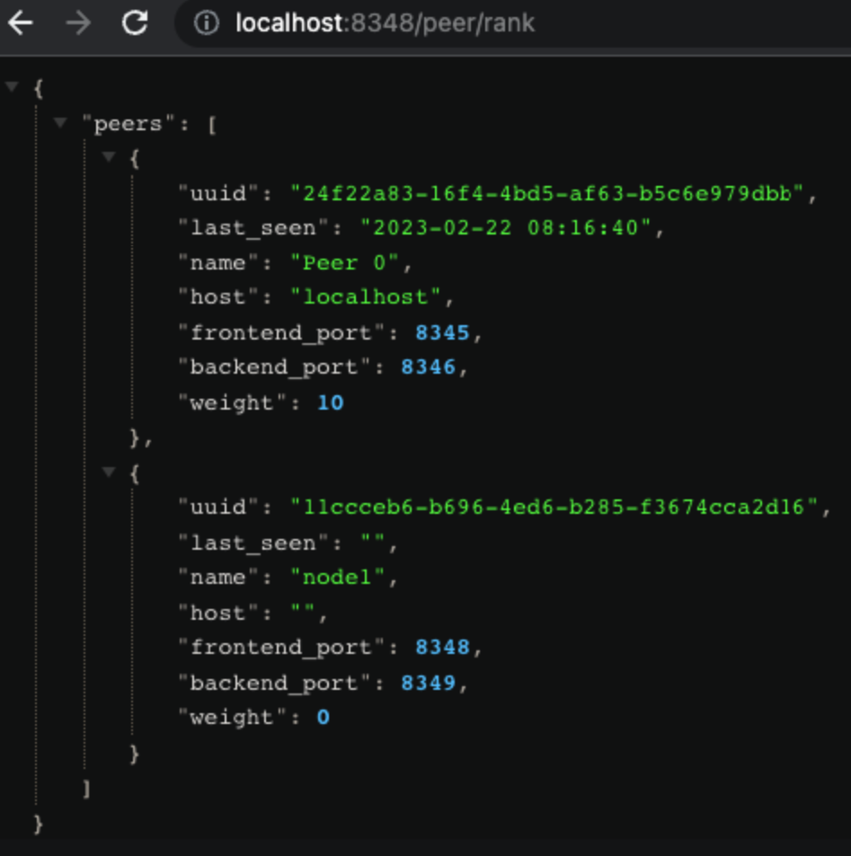

# DESIGN DOCUMENT #

[DOWNLOAD PDF FILE](design/design.pdf)

<br/>


# Instruction to Start HTTP Server #

Go to the directory: `hw3`, execute:

```
make clean && make && ./vodserver $(port1) $(port2)
```

<br />


<br/><br/>
# TCP Peer Checker #

The Peer Checker is a TCP service that connects with all peers every 10 seconds and sends its own network map to all other peers.

Upon receiving the network update, each server records the time of connection. The filter set determines which server is considered "alive," and this server can be included in the response. By default, the code displays all records for each peer.

<br/><br/>


# HTTP Server #
```
/peer/uuid
```
This path displays the UUID set in the node.conf file. If the file doesn't exist, a default one is generated.

<br/><br/>
```
/peer/neighbors
```
This path displays all the peers of the current server specified in the node.conf file. This path updates when the /peer/addneighbor path is called.

<br/><br/>


```
/peer/addneighbor?uuid=e94fc272-5611-4a61-8b27-de7fe233797f&host=nu.ece.cmu.edu&frontend=18345&backend=18346&metric=30
```
This path allows the user to add a neighbor with the specified UUID, host, frontend port, backend port, and metric. This updates the network map for the requested server.
<br/><br/>
⚠️Make sure there are no spaces or “%20” in the url or there will be errors ⚠️

<br/><br/>


```
/peer/map
```
This path displays the entire network architecture with all metrics and all levels of hierarchy included.

<br/><br/>
```
/peer/rank/<content path>
```
This path displays all the peers of the server but shows only the calculated fastest path based on the metric of each peer.
<br/>
<br/>
⚠️
Note that since the add-file-path feature from HW2 doesn't specify the "UUID" and "node name”, there is no way to map a file path to a node properly without altering the original specified format. This is because a server may have multiple names or UUID. A filter can be easily applied based on the "UUID" or "node name" if the file-path relationship is known. This information is missing for HW3; therefore, the shortest paths to all nodes are shown instead. ⚠️

<br/><br/>

<br />


# Docker #


Initial Image build:
```
sh docker-init.sh
```

Start HTTP server:
```
docker-compose up
```


<br />


