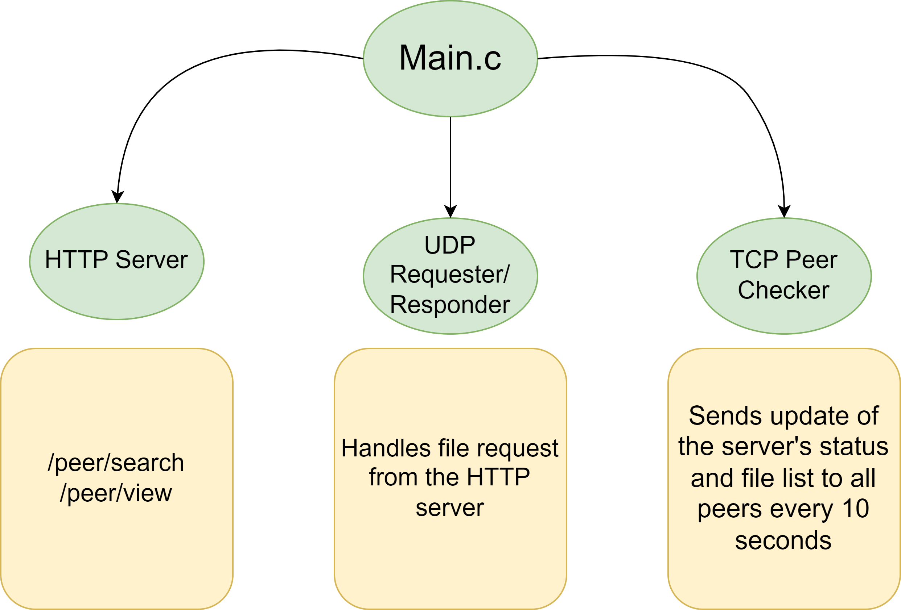
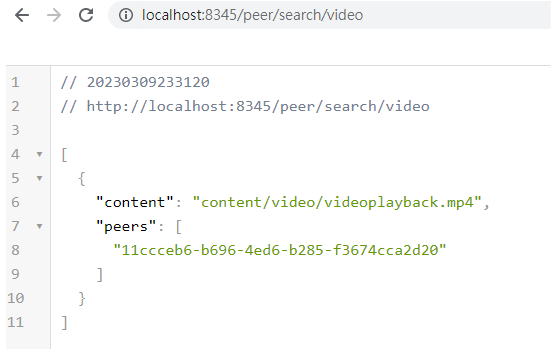
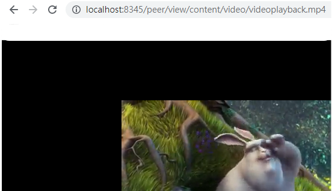

# DESIGN DOCUMENT #

[DOWNLOAD PDF FILE](design/design.pdf)

<br/>


# Instruction to Start HTTP Server #

Go to the directory: `hw4`, execute:

```
make clean && make && ./vodserver $(port1) $(port2)
```
<br />

You can see how to test the url requests [by clicking here](#http-server)

<br /><br />

# Code Architecture #

<br/><br/>
# TCP Peer Checker #

The Peer Checker is a TCP service that connects with all peers every 10 seconds and sends its own network map to all other peers.

Upon receiving the network update, each server records the time of connection. The filter set determines which server is considered "alive," and this server can be included in the response. By default, the code displays all records for each peer.

<br/><br/>

<a id="http-server"></a>
# HTTP Server # 


```
/peer/search/<search path>
```
This path allows for the display of all files within a specified subdirectory (e.g., images, videos, etc.) and presents all available content for viewing.
<br/>
<br/>


<br/><br/>

```
/peer/view/<content path>
```
This path allows for the display of the specific file  content that is requested based on the content path given in the peer_search method.
<br/>
<br/>


<br/><br/>

<br />


# Docker #


Initial Image build:
```
sh docker-init.sh
```

Start HTTP server:
```
docker-compose up
```


<br />


